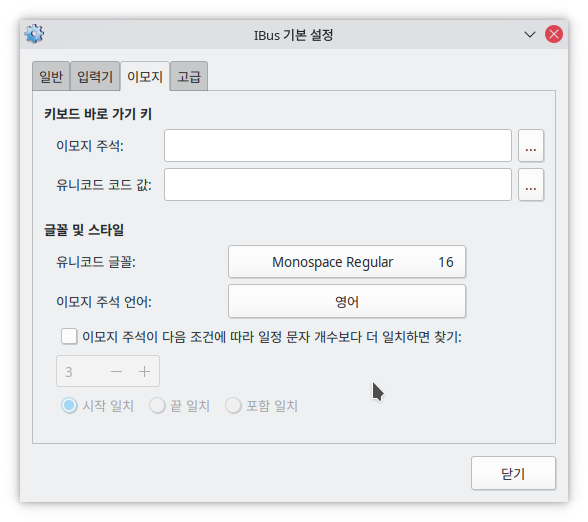

---
tags:
  - 우분투
  - IBus
---

# 키보드, 단축키 그리고 IBus

## `ctrl+;` 를 눌렀을 시 입력이 되지 않고 이상하게 동작함

- `ibus-setup` 실행
- `이모지` 탭에서 `키보드 바로 가기 키` 전체 제거

[관련 링크](https://forums.debian.net/viewtopic.php?f=6&p=752386)
